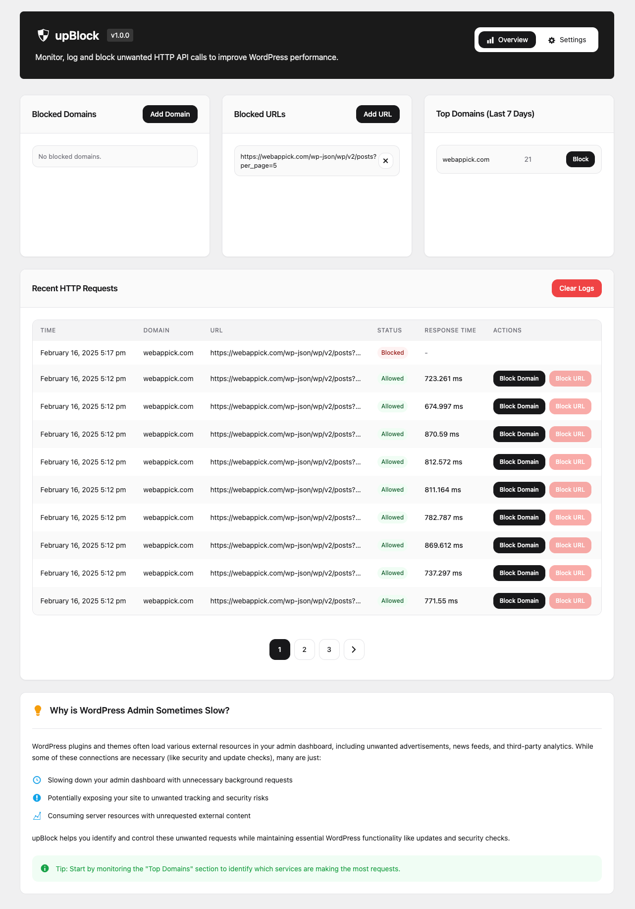

# upBlock - Block Unwanted HTTP Requests in WordPress Admin



[](https://wordpress.org/plugins/upblock/)
[](https://wordpress.org/plugins/upblock/)
[](https://wordpress.org/plugins/upblock/)
[](https://www.gnu.org/licenses/gpl-2.0.html)

Monitor, log and block unwanted HTTP API calls in WordPress admin to improve performance.

## ❓ Why is WordPress Admin Sometimes Slow?

WordPress plugins and themes often load various external resources in your admin dashboard, including unwanted advertisements, news feeds, and third-party analytics. While some of these connections are necessary (like security and update checks), many are just:

- 🐌 Slowing down your admin dashboard with unnecessary background requests
- 🔓 Potentially exposing your site to unwanted tracking and security risks
- 🖥️ Consuming server resources with unrequested external content

upBlock helps you identify and control these unwanted requests while maintaining essential WordPress functionality like updates and security checks.

## 📑 Table of Contents
- [Why is WordPress Admin Sometimes Slow?](#-why-is-wordpress-admin-sometimes-slow)
- [Features](#-features)
- [Requirements](#-requirements)
- [Installation](#-installation)
- [Usage](#-usage)
- [Configuration](#️-configuration)
- [Contributing](#-contributing)
- [Support](#-support)
- [License](#-license)
- [Changelog](#-changelog)

## 🚀 Features

- 📊 Monitor all HTTP requests made from your WordPress admin
- 🚫 Block unwanted domains and URL patterns
- 📝 Detailed request logging with response times
- 🔍 View top domains making requests
- ⚡ Improve admin performance by blocking unnecessary requests
- 🛡️ Enhanced security through request monitoring
- 🧹 Automatic log cleanup for optimal database performance

## 📋 Requirements

- WordPress 5.0 or higher
- PHP 8.0 or higher
- MySQL 5.6 or higher

## 💽 Installation

1. Download the latest release from [WordPress.org](https://wordpress.org/plugins/upblock/)
2. Upload the plugin to your WordPress site
3. Activate the plugin through the 'Plugins' menu in WordPress
4. Navigate to upTools > upBlock in your admin menu

Or install directly from WordPress:

1. Go to Plugins > Add New
2. Search for "upBlock"
3. Click "Install Now"
4. Activate the plugin

## 🎯 Usage

### Monitoring Requests

The main dashboard shows you:
- Recent HTTP requests with their status and response times
- Top domains making requests
- Currently blocked domains and URLs

### Blocking Requests

You can block requests in two ways:
1. Add domains directly to the blocklist
2. Add URL patterns to block specific endpoints

### Managing Logs

Configure logging settings:
- Set log retention period (1-365 days)
- Enable/disable logging of blocked requests
- Enable/disable automatic log cleanup

## 🛠️ Configuration

### Hooks & Filters

```php
// Filter blocked domains
add_filter('upblock_blocked_domains', function($domains) {
    $domains[] = 'example.com';
    return $domains;
});

// Filter blocked URLs
add_filter('upblock_blocked_urls', function($urls) {
    $urls[] = 'https://example.com/api/';
    return $urls;
});
```

## 🤝 Contributing

We welcome contributions! Here's how you can help:

1. Fork the repository
2. Create a feature branch (`git checkout -b feature/amazing-feature`)
3. Commit your changes (`git commit -m 'Add amazing feature'`)
4. Push to the branch (`git push origin feature/amazing-feature`)
5. Open a Pull Request

Please read [CONTRIBUTING.md](CONTRIBUTING.md) for details on our code of conduct and the process for submitting pull requests.

## 📜 License

This project is licensed under the GPL v2 or later - see the [LICENSE](LICENSE) file for details.

## 👥 Authors

- **upTools Team** - *Initial work* - [uptools.io](https://uptools.io)

## 🙏 Acknowledgments

- WordPress Core Team for the HTTP API
- All contributors who have helped improve this plugin

## 📞 Support

For support and documentation, please:
1. Check our [documentation](https://github.com/uptools-io/upblock/wiki)
2. Visit our [issues page](https://github.com/uptools-io/upblock/issues)
3. Review our [discussions](https://github.com/uptools-io/upblock/discussions)

For security issues, please report them directly through our [security page](https://github.com/uptools-io/upblock/security).

## 🗺️ Roadmap

Planned features:
- Advanced analytics dashboard
- API request rate limiting
- Custom blocking rules
- Export/import settings
- Integration with popular security plugins

## 🔄 Changelog

### 1.0.0 (Latest)
- Initial release
- Core monitoring functionality
- Domain blocking system
- Logging system implementation
- Admin interface

### Development
- See [CHANGELOG.md](CHANGELOG.md) for full version history

## 🔒 Security

### Reporting Security Issues
Please report security issues to security@uptools.io. We take security seriously and will respond promptly.

### Best Practices
- Keep the plugin updated
- Regularly review blocked domains
- Monitor logs for suspicious activity
- Use strong WordPress admin passwords

## ⚡ Performance

The plugin is designed with performance in mind:
- Minimal impact on front-end
- Efficient database queries
- Automatic log cleanup
- Optimized blocking system

## 🌐 Compatibility

Tested with:
- Popular WordPress themes
- Major page builders
- Common caching plugins
- Security plugins

---

Made with ❤️ by [upTools](https://uptools.io)